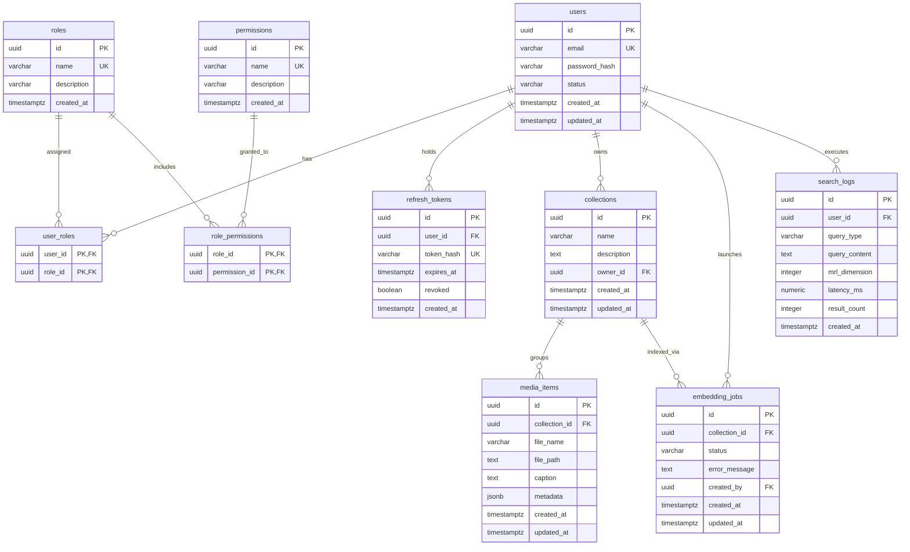

# MRL Cross-Modal Retrieval Platform — Complete System Architecture & Database Design Blueprint

This document outlines the system architecture, authentication & RBAC flow, database schema design, and advanced graduation-level feature designs for the CLIP Matryoshka Representation Learning (MRL) Cross-Modal Retrieval platform (`frontend/`, `core-api/`, `ai-worker/`).

---

## Deliverable 1: 3-Tier System Architecture & Secure RBAC Flow

### 1. System Architecture & Service Boundaries
The system is built on a **3-Tier Asynchronous Microservice Architecture** ensuring strict physical and logical decoupling in accordance with `AGENTS.md`:

1. **Frontend Presentation Layer (`frontend/`)**: Next.js 15 (App Router).
   - *Role*: Renders the visual dashboard, handles search queries, manages dynamic MRL dimension selections, displays performance benchmarking metrics, and renders returned visuals.
   - *Security/Boundary Policy*: Has zero access to PyTorch model files (`.pt`), FAISS index files (`.index`), database connection credentials, or RabbitMQ message routing. It communicates strictly with the `core-api` Gateway via HTTP REST.
2. **Core API Gateway (`core-api/`)**: Go Gin HTTP REST gateway.
   - *Role*: Manages user sessions, processes JWT tokens, verifies authorization claims, handles dataset uploads, creates database logs, generates unique Correlation IDs, and acts as a RabbitMQ RPC client.
   - *Security/Boundary Policy*: No model execution or PyTorch libraries. It communicates asynchronously with `ai-worker` over the `search_queue` channel using AMQP RPC.
3. **AI Worker Service (`ai-worker/`)**: Python / PyTorch / Pika.
   - *Role*: Loads fine-tuned CLIP MRL model checkpoints, extracts embeddings, constructs nested multi-dimensional FAISS indexes (8, 16, 32, 64, 128, 256, 512 dimensions), and executes Two-Stage Adaptive Reranking and Alpha Query Expansion (AQE).
   - *Security/Boundary Policy*: Fully isolated daemon. It has no connection strings to the primary relational database. It relies strictly on incoming AMQP headers/payloads and publishes results back via RabbitMQ.

---

### 2. Authentication & Authorization (RBAC) Flow

#### A. Dual Token JWT Structure
To secure client access and maintain dynamic role privileges, the Gateway implements a secure authentication flow:
- **Access Token**: Short-lived (15 minutes), signed using HMAC-SHA256 (`HS256`).
  ```json
  {
    "iss": "mrl_search_gateway",
    "sub": "9b1deb4d-3b7d-4bad-9bdd-2b0d7b3dcb6d",
    "user_id": "9b1deb4d-3b7d-4bad-9bdd-2b0d7b3dcb6d",
    "roles": ["User"],
    "exp": 1784236800,
    "iat": 1784235900
  }
  ```
- **Refresh Token**: Long-lived (7 days), a cryptographically secure 256-bit random entropy string encoded in Base64. Persisted in PostgreSQL hashed using SHA-256.

#### B. Token Rotation & Reuse Detection
1. **Rotation**: Upon requesting a token refresh, the client presents the Refresh Token. If valid, the gateway revokes the token, generates a new Access/Refresh pair, and saves the new token's SHA-256 hash.
2. **Abuse Mitigation (Reuse Detection)**: If a client attempts to refresh using a *revoked* token, the system assumes token theft has occurred. It immediately revokes all active refresh tokens for the associated user, writes a security breach log, and forces a full user re-authentication.

#### C. Go Gin Middleware Design
To protect restricted endpoints, the Gateway integrates middleware layers in Go Gin:
- `AuthMiddleware`: Validates incoming Bearer JWT signatures and sets metadata values (`user_id`, `roles`) on the request context.
- `RBACMiddleware`: Evaluates whether the claims match allowed roles (`Admin` or `User`).

---

### 3. Header & Correlation ID Propagation Flow
The asynchronous AMQP communication utilizes a robust RPC pattern to link blocking gateway endpoints with the background Python worker:
1. **Request Reception**: User sends `POST /api/search/text` with Bearer Token and `X-MRL-Dimension` header.
2. **Context Enrichment**: The Gateway parses the JWT, generates a unique **Correlation ID** (UUIDv4), and starts a high-precision timer.
3. **RPC Publication**: The Gateway publishes a message to `search_queue` with properties:
   - `CorrelationId`: The unique UUIDv4.
   - `ReplyTo`: Gateway's temporary, exclusive callback queue.
   - `Headers`:
     - `mrl_dimension`: `int32` representation of target slice (e.g. `256`)
     - `search_type`: `"text"` or `"image"`
     - `user_id`: UUID of request owner
4. **Worker Slicing & Search**: The AI Worker processes the message, slices the embedding tensor to the dynamic dimension (e.g. `[:256]`), searches the active FAISS index, and performs two-stage reranking.
5. **RPC Response Delivery**: The Worker publishes the results array back to the queue specified in `ReplyTo` using the same `CorrelationId`.
6. **Correlation & Logging**: The Gateway correlates the response via UUID, computes the full latency, logs the record in PostgreSQL (`search_logs`), and returns the results to the client.

---

### 4. Mermaid Sequence Diagrams

#### Diagram A: Synchronous User Authentication & RBAC Token Issuance
```mermaid
sequenceDiagram
    autonumber
    actor Client as User / Frontend (Next.js)
    participant Gateway as Core API (Go Gin Gateway)
    database DB as PostgreSQL Database
    
    Client->>Gateway: POST /api/auth/login (email, password)
    activate Gateway
    Gateway->>DB: Query user records & roles by email
    activate DB
    DB-->>Gateway: User entity, password hash, assigned roles
    deactivate DB
    Gateway->>Gateway: Verify password match (bcrypt)
    alt Authentication Fails
        Gateway-->>Client: 401 Unauthorized (Invalid credentials)
    else Authentication Succeeds
        Gateway->>Gateway: Generate Access Token (15m JWT: user_id, roles)
        Gateway->>Gateway: Generate cryptographically secure Refresh Token
        Gateway->>Gateway: Compute Refresh Token hash (SHA-256)
        Gateway->>DB: INSERT into refresh_tokens (user_id, token_hash, expires_at)
        activate DB
        DB-->>Gateway: Success (Token persisted)
        deactivate DB
        Gateway-->>Client: 200 OK (JSON with Access Token & HTTP-only Cookie Refresh Token)
    end
    deactivate Gateway
```

#### Diagram B: Asynchronous Multimodal Search Job over RabbitMQ RPC
```mermaid
sequenceDiagram
    autonumber
    actor Client as User / Frontend (Next.js)
    participant Gateway as Core API (Go Gin Gateway)
    participant AuthMW as Auth & RBAC Middleware
    participant MQ as RabbitMQ Broker (search_queue)
    participant Worker as AI Worker (Python PyTorch)
    database DB as PostgreSQL Database

    Client->>Gateway: POST /api/search/text (query, mrl_dimension) with Bearer token
    activate Gateway
    Gateway->>AuthMW: Execute Auth & RBAC checks
    activate AuthMW
    AuthMW->>AuthMW: Verify signature, exp, and roles
    AuthMW-->>Gateway: Authorized (user_id = 9b1deb4d..., role = "User")
    deactivate AuthMW

    Gateway->>Gateway: Generate Correlation ID (UUIDv4)
    Gateway->>Gateway: Record start timestamp
    Gateway->>MQ: Publish to "search_queue" (CorrelationId, ReplyTo, Headers: mrl_dimension, search_type)
    activate MQ
    MQ-->>Gateway: Acknowledge publication
    deactivate MQ

    Note over Gateway: Gateway blocks, listening on temporary reply queue for matching Correlation ID

    MQ->>Worker: Dispatch job to Python consumer
    activate Worker
    Worker->>Worker: Read headers (mrl_dimension = 256, search_type = "text")
    Worker->>Worker: Extract text embedding (512-dim)
    Worker->>Worker: Apply Alpha Query Expansion (AQE)
    Worker->>Worker: Search local FAISS index (Truncated to first 256 dimensions)
    Worker->>Worker: Perform Two-Stage Reranking on Top-50 candidates
    Worker->>MQ: Publish response to ReplyTo queue (CorrelationId, JSON payload)
    activate MQ
    Worker->>Worker: Send message basic_ack
    deactivate Worker

    MQ-->>Gateway: Deliver response from reply queue
    activate Gateway
    deactivate MQ

    Gateway->>Gateway: Correlate UUID with blocked request handler
    Gateway->>Gateway: Compute search latency = current_time - start_time
    Gateway->>DB: Log transaction (user_id, query_type, mrl_dimension, latency, count)
    activate DB
    DB-->>Gateway: Success
    deactivate DB

    Gateway-->>Client: 200 OK (JSON search results & latency metrics)
    deactivate Gateway
```

---

## Deliverable 2: Comprehensive PostgreSQL Database Schema & Mermaid ERD

### 1. Structured DDL Specifications
This schema defines a robust, scalable PostgreSQL structure. Performance indexes are optimized for UUID joins and query analytics over dynamic sizes.

```sql
-- Enable UUID extension
CREATE EXTENSION IF NOT EXISTS "uuid-ossp";

-- ==========================================
-- 1. Users Table
-- ==========================================
CREATE TABLE users (
    id UUID PRIMARY KEY DEFAULT uuid_generate_v4(),
    email VARCHAR(255) UNIQUE NOT NULL,
    password_hash VARCHAR(255) NOT NULL,
    status VARCHAR(50) DEFAULT 'active' NOT NULL CHECK (status IN ('active', 'inactive', 'suspended')),
    created_at TIMESTAMP WITH TIME ZONE DEFAULT CURRENT_TIMESTAMP NOT NULL,
    updated_at TIMESTAMP WITH TIME ZONE DEFAULT CURRENT_TIMESTAMP NOT NULL
);

-- ==========================================
-- 2. Roles Table
-- ==========================================
CREATE TABLE roles (
    id UUID PRIMARY KEY DEFAULT uuid_generate_v4(),
    name VARCHAR(50) UNIQUE NOT NULL,
    description VARCHAR(255),
    created_at TIMESTAMP WITH TIME ZONE DEFAULT CURRENT_TIMESTAMP NOT NULL
);

-- ==========================================
-- 3. User Roles Association Table
-- ==========================================
CREATE TABLE user_roles (
    user_id UUID REFERENCES users(id) ON DELETE CASCADE,
    role_id UUID REFERENCES roles(id) ON DELETE CASCADE,
    PRIMARY KEY (user_id, role_id)
);

-- ==========================================
-- 4. Permissions Table
-- ==========================================
CREATE TABLE permissions (
    id UUID PRIMARY KEY DEFAULT uuid_generate_v4(),
    name VARCHAR(100) UNIQUE NOT NULL,
    description VARCHAR(255),
    created_at TIMESTAMP WITH TIME ZONE DEFAULT CURRENT_TIMESTAMP NOT NULL
);

-- ==========================================
-- 5. Role Permissions Association Table
-- ==========================================
CREATE TABLE role_permissions (
    role_id UUID REFERENCES roles(id) ON DELETE CASCADE,
    permission_id UUID REFERENCES permissions(id) ON DELETE CASCADE,
    PRIMARY KEY (role_id, permission_id)
);

-- ==========================================
-- 6. Refresh Tokens Table (Token Rotation)
-- ==========================================
CREATE TABLE refresh_tokens (
    id UUID PRIMARY KEY DEFAULT uuid_generate_v4(),
    user_id UUID REFERENCES users(id) ON DELETE CASCADE NOT NULL,
    token_hash VARCHAR(255) UNIQUE NOT NULL,
    expires_at TIMESTAMP WITH TIME ZONE NOT NULL,
    revoked BOOLEAN DEFAULT FALSE NOT NULL,
    created_at TIMESTAMP WITH TIME ZONE DEFAULT CURRENT_TIMESTAMP NOT NULL
);

-- ==========================================
-- 7. Collections Table (Datasets)
-- ==========================================
CREATE TABLE collections (
    id UUID PRIMARY KEY DEFAULT uuid_generate_v4(),
    name VARCHAR(100) NOT NULL,
    description TEXT,
    owner_id UUID REFERENCES users(id) ON DELETE SET NULL,
    created_at TIMESTAMP WITH TIME ZONE DEFAULT CURRENT_TIMESTAMP NOT NULL,
    updated_at TIMESTAMP WITH TIME ZONE DEFAULT CURRENT_TIMESTAMP NOT NULL
);

-- ==========================================
-- 8. Media Items Table (Uploaded multimodal data)
-- ==========================================
CREATE TABLE media_items (
    id UUID PRIMARY KEY DEFAULT uuid_generate_v4(),
    collection_id UUID REFERENCES collections(id) ON DELETE CASCADE NOT NULL,
    file_name VARCHAR(255) NOT NULL,
    file_path TEXT NOT NULL,
    caption TEXT NOT NULL,
    metadata JSONB DEFAULT '{}'::jsonb NOT NULL,
    created_at TIMESTAMP WITH TIME ZONE DEFAULT CURRENT_TIMESTAMP NOT NULL,
    updated_at TIMESTAMP WITH TIME ZONE DEFAULT CURRENT_TIMESTAMP NOT NULL
);

-- ==========================================
-- 9. Embedding Jobs Table
-- ==========================================
CREATE TABLE embedding_jobs (
    id UUID PRIMARY KEY DEFAULT uuid_generate_v4(),
    collection_id UUID REFERENCES collections(id) ON DELETE CASCADE NOT NULL,
    status VARCHAR(50) DEFAULT 'pending' NOT NULL CHECK (status IN ('pending', 'processing', 'completed', 'failed')),
    error_message TEXT,
    created_by UUID REFERENCES users(id) ON DELETE SET NULL,
    created_at TIMESTAMP WITH TIME ZONE DEFAULT CURRENT_TIMESTAMP NOT NULL,
    updated_at TIMESTAMP WITH TIME ZONE DEFAULT CURRENT_TIMESTAMP NOT NULL
);

-- ==========================================
-- 10. Search Logs Table (Analytics & Benchmark Metrics)
-- ==========================================
CREATE TABLE search_logs (
    id UUID PRIMARY KEY DEFAULT uuid_generate_v4(),
    user_id UUID REFERENCES users(id) ON DELETE SET NULL,
    query_type VARCHAR(10) NOT NULL CHECK (query_type IN ('text', 'image')),
    query_content TEXT NOT NULL,
    mrl_dimension INT NOT NULL CHECK (mrl_dimension IN (8, 16, 32, 64, 128, 256, 512)),
    latency_ms NUMERIC(10, 2) NOT NULL,
    result_count INT NOT NULL,
    created_at TIMESTAMP WITH TIME ZONE DEFAULT CURRENT_TIMESTAMP NOT NULL
);

-- ==========================================
-- Performance Indexes
-- ==========================================
CREATE INDEX idx_users_email ON users(email);
CREATE INDEX idx_refresh_tokens_hash ON refresh_tokens(token_hash);
CREATE INDEX idx_user_roles_role_id ON user_roles(role_id);
CREATE INDEX idx_role_permissions_permission_id ON role_permissions(permission_id);
CREATE INDEX idx_collections_owner_id ON collections(owner_id);
CREATE INDEX idx_media_items_collection_id ON media_items(collection_id);
CREATE INDEX idx_embedding_jobs_collection_status ON embedding_jobs(collection_id, status);
CREATE INDEX idx_search_logs_user_id ON search_logs(user_id);
CREATE INDEX idx_search_logs_created_at_dim ON search_logs(created_at, mrl_dimension);
```

---

### 2. Mermaid Entity-Relationship Diagram (ERD)
This ERD models relationship linkages and primary/foreign key mappings with strict cardinality:



---

## Deliverable 3: Graduation-Level Advanced Feature Recommendations

To elevate this project into a top-tier academic thesis, the following features are recommended for subsequent implementation:

### 1. Dynamic SLA-Driven MRL Routing & Autocaching
- **Concept**: Adapts search dimensionality in real time based on active system load (queue sizes) or SLA settings, matching latency targets (e.g. <100ms) with optimal dimensionality.
- **Workflow**: If Go API detects AMQP processing delays, it downroutes the request's MRL dimension (e.g., from `512` to `64`). Relies on a Redis cache configured with dimension-aware key patterns (e.g., `query:caption:64`) to preserve vector math integrity.

### 2. Asynchronous Usage Telemetry & Billing (Vector Metering)
- **Concept**: Charges or metrics users dynamically based on computational resource usage. Higher dimensions require more bandwidth, RAM, and distance calculations.
- **Workflow**: The API Gateway publishes usage payloads (`{"user_id": "...", "dimension": 512, "units": 1}`) to RabbitMQ (`telemetry_exchange`). An asynchronous worker consumes logs and writes them to billing tables (`vector_usage_records`) in bulk, preventing bottlenecking on search calls.

### 3. Real-Time MRL vs. Fixed-Feature Comparative Benchmark Suite
- **Concept**: Validates MRL theories empirically on the live system. Compares query Recall@K, storage bounds, and indexing latencies between adaptive MRL dimensions and a static baseline model.
- **Workflow**: Python worker processes evaluations using validation sets. It writes data to `benchmark_results`. The Next.js frontend fetches these records to render interactive comparative charts (recall-vs-dimension, latency-vs-accuracy frontier curves).

### 4. AI Query Expansion Copilot & Late-Interaction Reranking
- **Concept**: Handles vocabulary mismatch (e.g. expanding "athleisure" to "sneakers, jogger, shoes") prior to searching, combined with deep cross-encoder re-evaluation.
- **Workflow**: The Go Gateway invokes an LLM helper to expand terms. The Python worker calculates the embedding, performs a fast Stage-1 search on the 64-D FAISS index (Top-50), and then feeds candidates into a sentence-transformers Cross-Encoder model (`cross-encoder/ms-marco-MiniLM-L-6-v2`) to produce highly accurate final rankings.
